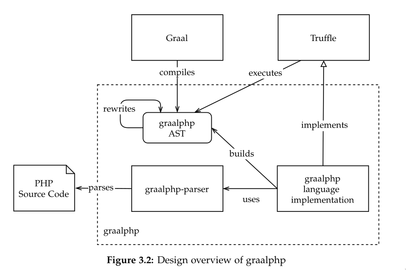
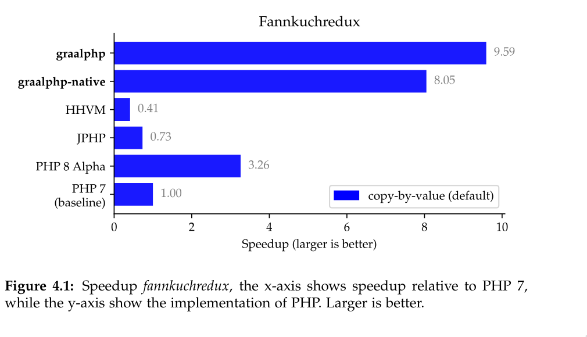

[](https://travis-ci.com/abertschi/graalphp)
[](https://codebeat.co/projects/github-com-abertschi-graalphp-master)
[](https://www.codefactor.io/repository/github/abertschi/graalphp)
[](https://www.codacy.com/manual/abertschi/graalphp?utm_source=github.com&amp;utm_medium=referral&amp;utm_content=abertschi/graalphp&amp;utm_campaign=Badge_Grade)
[](https://codecov.io/gh/abertschi/graalphp)
[]()

# A PHP implementation built on GraalVM
Graalphp is an experimental just-in-time (JIT) compiler and runtime
for PHP 7.4+. This is a thesis project at ETH Zurich.

### Abstract
  _PHP is a popular, weakly typed, general purpose programming
  language. Originally designed for building dynamic web pages, the
  language has since gained wide adoption in server-side web
  development.  In this work, we describe the design and
  implementation of graalphp, an experimental compiler and
  runtime for PHP hosted on Truffle and GraalVM. GraalVM is a virtual
  machine that supports execution of multiple languages, which are
  implemented as Abstract Syntax Tree (AST) interpreters based on
  Truffle. GraalVM uses Graal as its JIT compiler to compile
  frequently executed code fragments to machine code.  We implement a
  subset of the PHP language to run synthetic benchmarks by
  The Computer Language Benchmarks Game. We compare peak
  performance of our implementation against PHP 7 as well as
  alternative implementations such as HHVM, JPHP and an early alpha
  version of PHP 8. Experimental results indicate that our runtime
  reaches competitive results with performance gains of up to 859%
  compared to PHP 7. These preliminary results
  suggest that a Truffle-hosted PHP implementation might be
  significantly faster than existing language implementations._

<p align="center">
    
</p>


- Thesis document: [./report.md/](./report-thesis.md/)

<p align="center">
  
</p>

- More Benchmarks: [./results.md/](./results.md/)

### Build and Run
For a container image with development and benchmark dependencies see
[./docker/](./docker/).

```shell
# Build Dependencies: Linux environment, maven, ant, GraalVM
# download GraalVM from https://github.com/graalvm/graalvm-ce-builds/releases
$ export JAVA_HOME=/path/to/graalvm
$ mvn package
$ ./graalphp <php-file.php>
```

```sh
# build native image:
$ export JAVA_HOME=/path/to/graalvm
$ $JAVA_HOME/bin/gu install native-image
$ export GRAALPHP_BUILD_NATIVE="true"
$ mvn package
```

### Feature Set
High Level Overview of implemented features, current runtime code
base. ca. 4000 LOC.

- Implemented features are chosen to support execution of the Computer
  Language Benchmark Game.
  
Non exhaustive list of features:
+ [x] Functions
+ [X] Arrays of integer, float, Arrays of Arrays
+ [X] Variable Scoped Variables, unset, assign
+ [X] Binary Operators
+ [X] Unary Operators
+ [ ] Classes
+ [ ] Namespaces
+ [ ] Exceptions


### More Resources
- Graal Github Issue for PHP support :: https://github.com/oracle/graal/issues/361
- GraalVM :: https://graalvm.org
