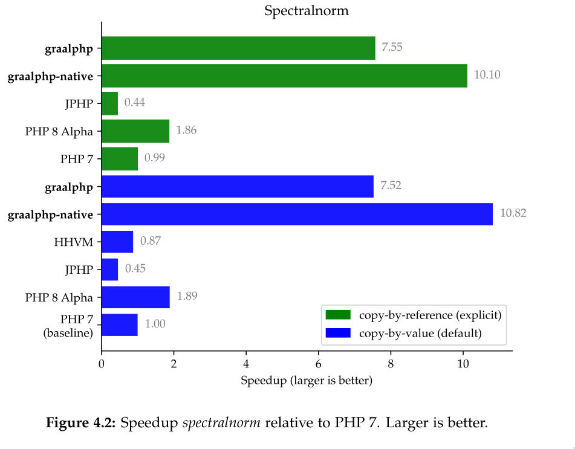
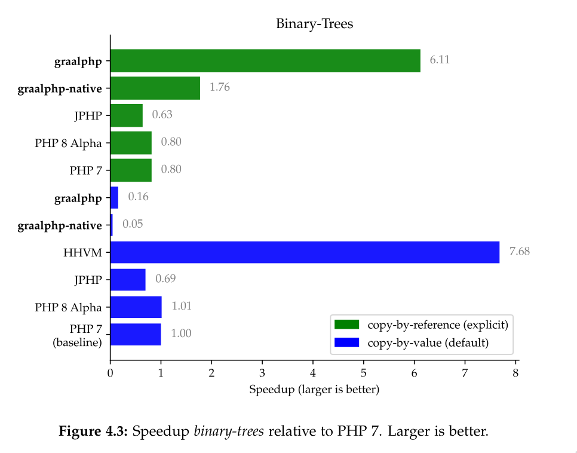
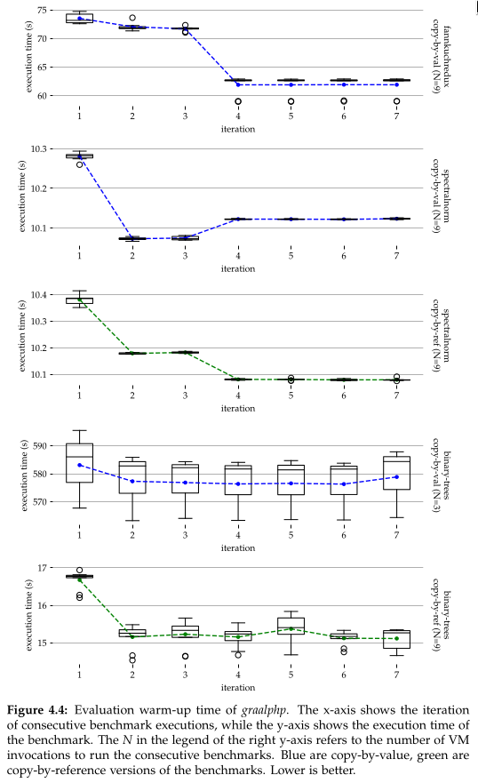
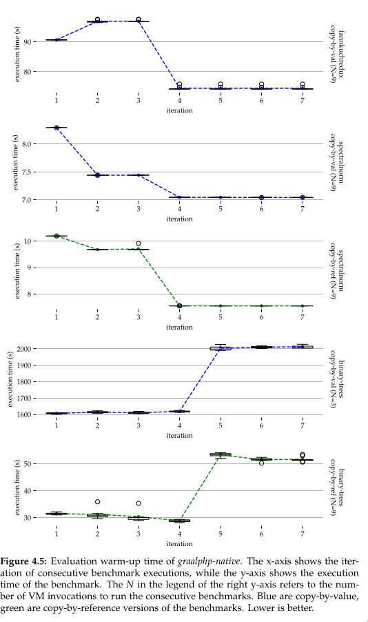

# Preliminary Evaluation
Evaluation of graalphp with synthetic benchmarks by The Computer
Language Benchmark Game. As of 5. Sept. 2020. See also ./benchmarks/evaluation/.

### Peak Performance






### Warm-up



### Experimental Setup
```
graalphp git hash: cb59d053633d
GraalVM Community Edition20.1.0
```

```
php --version
PHP 7.4.3 (cli) (built: May 26 2020 12:24:22) ( NTS )
Copyright (c) The PHP Group
Zend Engine v3.4.0, Copyright (c) Zend Technologies
    with Zend OPcache v7.4.3, Copyright (c), by Zend Technologies

```

```
php8 --version
PHP 8.0.0alpha3 (cli) (built: Aug  6 2020 12:31:02) ( NTS )
Copyright (c) The PHP Group
Zend Engine v4.0.0-dev, Copyright (c) Zend Technologies
    with Zend OPcache v8.0.0alpha3, Copyright (c), by Zend Technologies
    

ini="/graalphp-build/php8/build/php/php.ini"
echo "zend_extension=opcache.so" >> $ini
echo "opcache.enable=1" >> $ini
echo "opcache.enable_cli=1" >> $ini

echo "opcache.jit_buffer_size=512M" >> $ini
echo "opcache.jit=1235" >> $ini
```

```
jppm 0.6.7 which bundles jphp 1.0.3, Open-JDK 14
```

```
HipHop VM 4.69.1 (rel)
Compiler: 1596652956_514733115
Repo schema: d1ae8e21bf3419a65f12a010527485564e719d07
```

```
Intel® Xeon® E-2176M CPU clocked at 2.7GHz - 4.4GHz and 16GB DDR4RAM. The device has Hyper-Threading disabled, Turbo Boost disabled, and CPU frequency driver intel pstate is used with governor performance manually set at a fixed clock rate of 2.7 GHz.
```

See docker file for a reproducible setup and technical report for more information.

