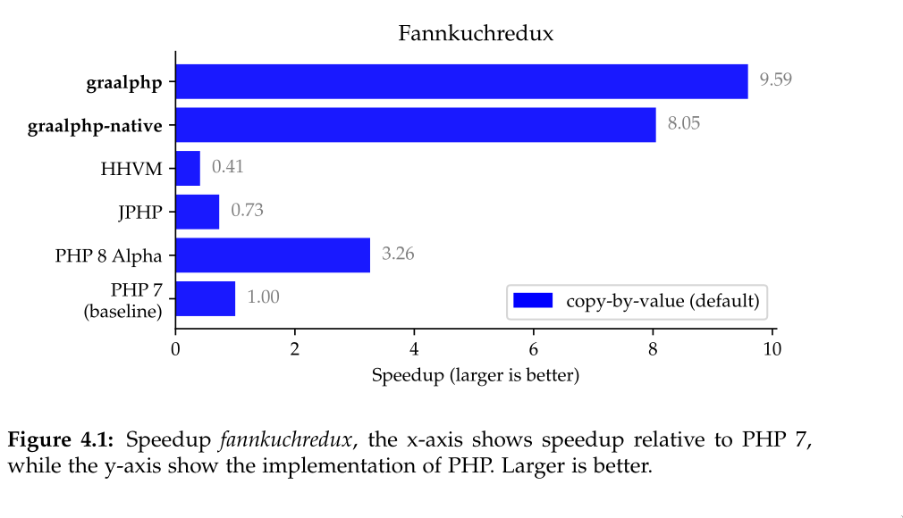

# Preliminary Evaluation
Evaluation of graalphp with synthetic benchmarks by The Computer
Language Benchmark Game. As of 5. Sept. 2020. See also ./benchmarks/evaluation/.

### Peak Performance

### Warm-up

